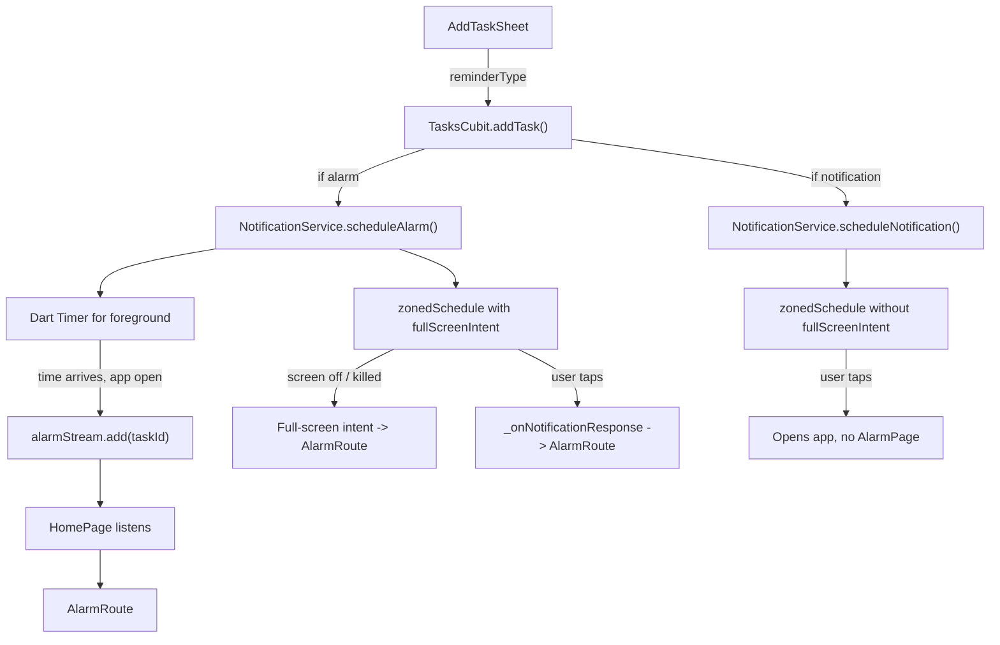

# Alarm vs Notification Choice

## The Problem

Currently, every scheduled task fires a push notification. The `AlarmPage` exists but only opens if the user taps the notification. There is no way for the user to choose between a quiet notification vs a full alarm, and the alarm never auto-appears in the foreground.

## Architecture

## Changes by File

### 1. TaskModel -- add `reminderType` field

**File:** [lib/infrastructure/models/tasks/task_model.dart](lib/infrastructure/models/tasks/task_model.dart)

- Add `String? reminderType` field (values: `"notification"`, `"alarm"`, or `null` for no reminder)
- `null` means no time was set; when a time IS set, the user picks one of the two types
- Requires `build_runner` regeneration

### 2. NotificationService -- split scheduling, add foreground timer

**File:** [lib/core/services/notification_service.dart](lib/core/services/notification_service.dart)

- Add a `StreamController<String>` called `alarmStream` -- emits `taskId` when a foreground alarm timer fires
- Add a `Map<String, Timer> _alarmTimers` to track active foreground timers
- Rename existing `scheduleTaskNotification` to two methods:
  - `scheduleNotification(TaskModel task)` -- `zonedSchedule` WITHOUT `fullScreenIntent`, normal importance, category = `reminder`. Payload prefix: `notif:taskId`
  - `scheduleAlarm(TaskModel task)` -- `zonedSchedule` WITH `fullScreenIntent` (current behavior). Also starts a Dart `Timer` for foreground. Payload prefix: `alarm:taskId`
- `cancelNotification(String taskId)` -- also cancels any active Timer for that task
- `scheduleAlarmTimers(List<TaskModel> tasks)` -- called on app start to restore foreground timers for all alarm-type tasks whose time is still in the future
- Update `_onNotificationResponse` -- parse payload prefix; only set `pendingResponseTaskId` if prefix is `alarm:`

### 3. TasksCubit -- pass reminderType through

**File:** [lib/presentation/features/home/cubit/tasks_cubit.dart](lib/presentation/features/home/cubit/tasks_cubit.dart)

- `addTask` gains a `String? reminderType` parameter, passed to `TaskModel` and conditionally calls `scheduleNotification` or `scheduleAlarm`
- `loadTasks` -- after loading, call `_notificationService.scheduleAlarmTimers(tasks)` to restore any foreground timers
- `rescheduleTask` -- preserve the task's `reminderType` and re-schedule accordingly
- `toggleTask` / `deleteTask` -- cancel logic already works (uses `cancelNotification` which will also cancel timers)

### 4. AddTaskSheet -- add reminder type selector

**File:** [lib/presentation/features/home/widgets/add_task_sheet.dart](lib/presentation/features/home/widgets/add_task_sheet.dart)

- Add state variable `String _reminderType = 'notification'` (default)
- Below the date/time picker `Row`, add a new row (only visible when `_selectedTime != null`):
  - Two side-by-side tappable tiles matching the existing `_buildPickerTile` style:
    - Bell icon + "Notify" -- selects `notification` type
    - Alarm icon + "Alarm" -- selects `alarm` type
  - Selected tile gets a green accent border; unselected stays dark
- Pass `_reminderType` to `TasksCubit.addTask()` in `_submit()`
- If no time is set, `reminderType` is passed as `null`

### 5. TaskCard -- show reminder type icon

**File:** [lib/presentation/features/home/widgets/task_card.dart](lib/presentation/features/home/widgets/task_card.dart)

- In `_buildTimeBadge`, prepend a small icon before the time text:
  - `Icons.notifications_none_rounded` for `notification` type
  - `Icons.alarm_rounded` for `alarm` type
- This gives the user a visual indication of which reminder mode is active

### 6. HomePage -- listen to alarm stream

**File:** [lib/presentation/features/home/pages/home_page.dart](lib/presentation/features/home/pages/home_page.dart)

- In `initState`, subscribe to `getIt<NotificationService>().alarmStream`
- When the stream emits a `taskId`, push `AlarmRoute(taskId: taskId)`
- Cancel the subscription in `dispose`
- Keep the existing `_checkPendingAlarm()` for background/killed scenarios

### 7. SplashPage -- update payload parsing

**File:** [lib/presentation/features/splash_page/splash_page.dart](lib/presentation/features/splash_page/splash_page.dart)

- `pendingAlarmTaskId` is set in `NotificationService.init()` -- update its extraction to only set it when payload starts with `alarm:`

### 8. i18n -- add new keys

**Files:** [lib/i18n/strings_en.i18n.json](lib/i18n/strings_en.i18n.json), [lib/i18n/strings_ar.i18n.json](lib/i18n/strings_ar.i18n.json)

- Add to `home` section: `"notify_label": "Notify"`, `"alarm_label": "Alarm"`

### 9. Build and verify

- `dart run build_runner build --delete-conflicting-outputs` (regenerate TaskModel, i18n)
- `flutter analyze`
