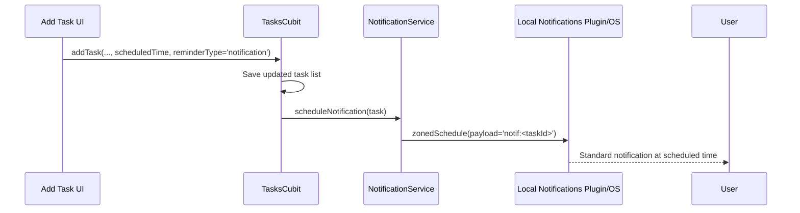
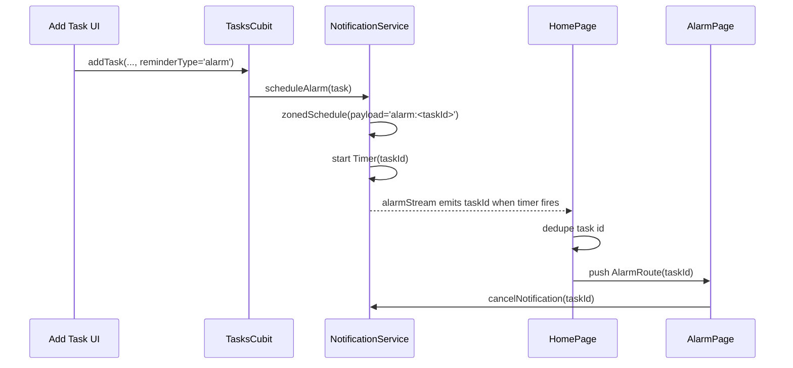
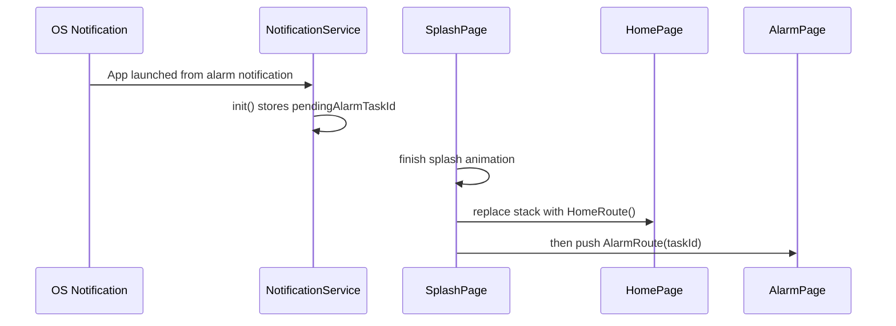

# Notification and Alarm Implementation

## Scope

This document describes the current notification/alarm feature as implemented in the working tree, not just the intended design.

The implementation adds two reminder modes for tasks:

- `notification`: a standard scheduled local notification.
- `alarm`: a scheduled local notification plus an in-app full-screen alarm experience.

The feature spans Flutter app code, task persistence, routing, and Android native configuration.

## High-Level Summary

At a high level, the feature works like this:

1. A task can now store a scheduled time and a reminder mode.
2. When a task is saved, the app schedules either:
   - a normal local notification, or
   - an alarm-style local notification with Android full-screen intent support.
3. Alarm tasks also start an in-memory Dart `Timer` so the app can push a custom `AlarmPage` immediately when the app process is alive.
4. If the app is launched from an alarm notification tap, startup code captures the task id and routes to the alarm screen after splash.
5. If the app is already alive and receives an alarm notification response, the home screen consumes the pending task id and pushes the alarm screen.
6. The alarm screen lets the user mark the task done, snooze it by 10 minutes, or dismiss the screen.

## File Map

### Core logic

- `lib/core/services/notification_service.dart`

### Task model and persistence

- `lib/infrastructure/models/tasks/task_model.dart`
- `lib/infrastructure/datasources/local_datasources/tasks_local_data_source.dart`
- `lib/infrastructure/repositories/tasks_repository_impl.dart`

### App startup and routing

- `lib/main.dart`
- `lib/presentation/dayflow_app.dart`
- `lib/presentation/common/routes/router.dart`
- `lib/presentation/common/routes/router.gr.dart`
- `lib/presentation/features/splash_page/splash_page.dart`

### Task creation and task list UI

- `lib/presentation/features/home/widgets/add_task_sheet.dart`
- `lib/presentation/features/home/widgets/task_card.dart`
- `lib/presentation/features/home/cubit/tasks_cubit.dart`
- `lib/presentation/features/home/pages/home_page.dart`

### Alarm UI

- `lib/presentation/features/alarm/pages/alarm_page.dart`

### Android platform wiring

- `android/app/src/main/AndroidManifest.xml`
- `android/app/src/main/kotlin/com/example/dayflow/MainActivity.kt`
- `android/app/build.gradle.kts`

### Dependencies and copy

- `pubspec.yaml`
- `lib/i18n/strings_en.i18n.json`
- `lib/i18n/strings_ar.i18n.json`

## Data Model Changes

`TaskModel` now stores two reminder-related fields:

- `scheduledTime`: nullable `String`, formatted as `HH:mm`
- `reminderType`: nullable `String`

Current effective values for `reminderType` are:

- `'notification'`
- `'alarm'`
- `null`

Important detail:

- The app uses `createdAt` as the task's logical day for filtering and scheduling.
- This means `createdAt` is not behaving as "record creation timestamp" anymore in this feature area.
- Scheduled reminders are combined from:
  - `createdAt` date
  - `scheduledTime` clock time

That combination is done in `NotificationService._combineDateAndTime(...)`.

## Dependencies Added

Two packages were added:

- `flutter_local_notifications`
- `timezone`

The app initializes timezone data during startup in `main.dart` before initializing the notification service.

## Architecture

The implementation has three cooperating layers:

1. Persistence layer
   - Stores reminder metadata on each task.

2. Scheduling layer
   - `NotificationService` schedules OS notifications.
   - For alarm tasks, it also manages in-memory timers and app-foreground bridging.

3. UI/routing layer
   - Lets the user choose reminder type.
   - Displays reminder type on task cards.
   - Navigates to `AlarmPage` when an alarm fires.

## NotificationService Deep Dive

`NotificationService` is the center of the feature.

### Responsibilities

It is responsible for:

- plugin initialization
- permission requests
- scheduling standard reminders
- scheduling alarm reminders
- maintaining in-memory timers for alarms
- restoring timers after task load
- cancelling individual reminders
- capturing notification response payloads

### Internal State

The service maintains:

- `_plugin`: the `FlutterLocalNotificationsPlugin` instance
- `_alarmTimers`: a `Map<String, Timer>` keyed by task id
- `_alarmStreamController`: a broadcast stream for alarm task ids

It also uses two different pending-id holders:

- top-level `pendingAlarmTaskId`
- static `NotificationService.pendingResponseTaskId`

These are used in different app-launch / app-resume flows.

### Initialization

`init()` does the following:

1. Configures Android and iOS plugin initialization settings.
2. Calls `_plugin.initialize(...)`.
3. Registers `_onNotificationResponse` as the notification response callback.
4. Reads `getNotificationAppLaunchDetails()`.
5. If the app was launched from an `alarm:<taskId>` payload, stores that task id in the top-level `pendingAlarmTaskId`.

This startup work is triggered from `main.dart` before `runApp(...)`.

### Permission Requests

`requestPermissions()` requests:

- Android notifications permission
- Android exact alarm permission
- iOS alert/badge/sound permissions

This method is called from both `scheduleNotification(...)` and `scheduleAlarm(...)`.

That means permissions are requested at scheduling time, not at app startup.

### Standard Notification Scheduling

`scheduleNotification(TaskModel task)` implements the normal reminder flow.

Behavior:

1. Exit if `scheduledTime` is null.
2. Build a concrete `DateTime` by combining `task.createdAt` and `task.scheduledTime`.
3. Convert that date to `tz.TZDateTime` in `tz.local`.
4. Exit if the scheduled time is already in the past.
5. Request permissions.
6. Call `_plugin.zonedSchedule(...)`.

Notification properties:

- channel id: `task_reminders_v3`
- importance: max
- priority: max
- Android category: `reminder`
- payload: `notif:<taskId>`

Important behavior:

- The code currently captures only `alarm:` responses for routing.
- Tapping a normal notification does not trigger any task-specific navigation in the current implementation.

### Alarm Scheduling

`scheduleAlarm(TaskModel task)` implements the alarm reminder flow.

Behavior:

1. Exit if `scheduledTime` is null.
2. Build a concrete `DateTime` using `createdAt + scheduledTime`.
3. Convert to local timezone-aware `TZDateTime`.
4. Exit if it is already in the past.
5. Request permissions.
6. Schedule a local notification with alarm-oriented settings.
7. Start an in-memory timer for the same task.

Alarm notification properties:

- channel id: `task_alarms_v3`
- importance: max
- priority: max
- `fullScreenIntent: true`
- Android category: `alarm`
- payload: `alarm:<taskId>`

The alarm path is intentionally hybrid:

- OS local notification for reliability when app is backgrounded or killed
- Dart `Timer` for immediate in-app routing while the process is alive

### Alarm Timer Strategy

`_startAlarmTimer(taskId, scheduledDt)` creates a Dart `Timer` for alarm tasks.

Behavior:

1. Cancel any existing timer for the same task id.
2. Compute the remaining delay.
3. Exit if the delay is negative.
4. Start a timer.
5. When the timer fires:
   - remove the timer from `_alarmTimers`
   - try to bring the app to the foreground
   - wait 300 ms
   - publish the task id to `alarmStream`

This is what drives the in-app alarm screen when the app process is still alive.

### Android Foreground Bridge

`_bringToForeground()` calls a method channel:

- channel: `dayflow/alarm`
- method: `bringToForeground`

Android handles that in `MainActivity.configureFlutterEngine(...)`.

Native behavior:

1. Resolve the app launch intent from the package manager.
2. Add:
   - `FLAG_ACTIVITY_NEW_TASK`
   - `FLAG_ACTIVITY_REORDER_TO_FRONT`
3. Start the activity.

This is meant to surface the app when the alarm timer fires and the app is backgrounded but still alive.

### Restore Logic

`restoreTimers(List<TaskModel> tasks)` only restores in-memory timers for alarm tasks.

Rules:

- ignore tasks without `scheduledTime`
- ignore completed tasks
- ignore tasks whose `reminderType` is not `'alarm'`
- ignore alarm times already in the past

This is called after tasks are loaded into `TasksCubit`.

Important design choice:

- Standard notifications are not restored manually.
- Alarm timers are restored because the OS notification alone is not enough to reopen the in-app alarm page while the process is alive.

### Cancellation

`cancelNotification(taskId)` does two things:

1. Cancels and removes the in-memory alarm timer for that task id.
2. Cancels the scheduled OS notification using `taskId.hashCode` as the notification id.

`cancelAll()` clears all timers and all plugin notifications.

## Task Scheduling Integration

`TasksCubit` owns the application-side scheduling decisions.

### On load

`loadTasks()`:

1. loads tasks from local storage
2. calls `NotificationService.restoreTimers(tasks)`
3. emits the loaded state

### On add

`addTask(...)` now accepts:

- `scheduledTime`
- `reminderType`

After saving the updated task list, it calls `_scheduleForTask(task)`.

`_scheduleForTask(...)` dispatches based on `reminderType`:

- `'alarm'` -> `scheduleAlarm(task)`
- anything else non-null -> `scheduleNotification(task)`

### On complete

`toggleTask(id)`:

- checks whether the action is changing the task from undone to done
- if yes, and the task has a scheduled time, it cancels the reminder before saving the new task state

### On delete

`deleteTask(id)` cancels any scheduled reminder before removing the task from storage.

### On snooze / reschedule

`rescheduleTask(id, newTime)`:

1. cancels the existing reminder
2. updates the task:
   - `createdAt` becomes the date of `newTime`
   - `scheduledTime` becomes the `HH:mm` of `newTime`
3. saves tasks
4. re-schedules the updated task through `_scheduleForTask(...)`

Notable detail:

- `reminderType` is preserved because `copyWith(...)` updates only `createdAt` and `scheduledTime`.

## Add Task Flow

The task-creation bottom sheet now exposes reminder mode selection.

### Default behavior

- `_reminderType` defaults to `'notification'`
- the reminder type selector appears only after a time is chosen

### Submission behavior

On submit:

1. selected time is converted to `HH:mm`
2. `TasksCubit.addTask(...)` is called
3. `reminderType` is passed only if a time exists

This means:

- tasks without a scheduled time have no reminder mode
- time-based tasks default to normal notifications unless the user explicitly chooses alarm

## Task Card Changes

Task cards now display reminder-type context in the time badge.

If `task.reminderType` is present:

- `alarm` shows `Icons.alarm_rounded`
- anything else shows `Icons.notifications_none_rounded`

This is only presentation logic. The badge does not itself schedule or alter behavior.

## Alarm Route and Navigation

The router now includes `AlarmRoute`.

`AlarmPage` is declared as a normal route, and generated route code is present in `router.gr.dart`.

There are three navigation entry paths into the alarm screen.

### Path 1: Foreground/live-process timer path

1. `NotificationService` timer fires
2. service emits task id on `alarmStream`
3. `HomePage` listens to the stream
4. `HomePage` pushes `AlarmRoute(taskId: ...)`

### Path 2: App resumed from notification response

1. plugin callback `_onNotificationResponse(...)` receives payload
2. if payload starts with `alarm:`, it stores the task id in `NotificationService.pendingResponseTaskId`
3. `HomePage.didChangeAppLifecycleState(...)` detects `resumed`
4. `HomePage._checkPendingAlarm()` consumes the pending task id
5. `HomePage` pushes `AlarmRoute`

### Path 3: Cold start from notification launch

1. app is launched from an alarm notification
2. `NotificationService.init()` reads launch details
3. it stores the task id in top-level `pendingAlarmTaskId`
4. splash screen ends
5. `SplashPage` replaces the route stack with:
   - `HomeRoute()`
   - `AlarmRoute(taskId: ...)`

This ensures the app enters through Home and then immediately shows the alarm screen.

## HomePage Alarm Coordination

`HomePage` became stateful to support alarm orchestration.

It now:

- observes app lifecycle
- subscribes to `NotificationService.alarmStream`
- checks pending notification-response state after first frame
- checks again on app resume

It also maintains `_handledAlarmIds`, a `Set<String>`, to prevent duplicate route pushes for the same task id.

The duplicate-suppression intent is understandable because the same alarm can be surfaced by:

- timer
- notification tap
- cold-start launch path

## AlarmPage Behavior

`AlarmPage` is the dedicated in-app alarm experience.

### On init

`initState()` does two things immediately:

1. triggers `HapticFeedback.heavyImpact()`
2. calls `NotificationService.cancelNotification(widget.taskId)`

That cancellation is important because:

- it removes the fallback OS notification
- it removes any still-active timer for the same task
- it avoids leaving duplicate alarm artifacts in the notification shade

### UI content

The page displays:

- a pulsing icon
- reminder heading
- task title
- optional subtitle
- formatted scheduled time

### Actions

`Mark Done`

- calls `TasksCubit.toggleTask(taskId)`
- pops the page

`Snooze 10 min`

- computes `DateTime.now().add(Duration(minutes: 10))`
- calls `TasksCubit.rescheduleTask(taskId, newTime)`
- pops the page

`Dismiss`

- only pops the page

Meaning of dismiss in current implementation:

- it stops the current alarm UI
- it does not mark the task done
- it does not create a new schedule

## Android Native Configuration

The Android side adds the permissions and behavior needed for exact and alarm-like delivery.

### Permissions added

- `POST_NOTIFICATIONS`
- `USE_EXACT_ALARM`
- `RECEIVE_BOOT_COMPLETED`
- `VIBRATE`
- `WAKE_LOCK`
- `USE_FULL_SCREEN_INTENT`

### Activity flags

`MainActivity` now sets:

- `android:showWhenLocked="true"`
- `android:turnScreenOn="true"`

These are attached directly to the main activity in the manifest.

### Plugin receivers

The manifest registers:

- `ScheduledNotificationReceiver`
- `ScheduledNotificationBootReceiver`

The boot receiver listens for:

- `BOOT_COMPLETED`
- `MY_PACKAGE_REPLACED`
- quick boot variants

This supports plugin-level rescheduling across reboot / app update scenarios.

### Gradle changes

Android build config now enables:

- core library desugaring
- multidex

and adds:

- `com.android.tools:desugar_jdk_libs:2.1.4`

## End-to-End Runtime Flows

### Flow A: Normal notification

### Flow B: Alarm while app process is alive

### Flow C: Alarm on cold app launch

## Persistence Behavior

Tasks are saved as JSON through the local tasks data source.

Because `TaskModel.toJson()` and `TaskModel.fromJson()` include:

- `scheduledTime`
- `reminderType`

the reminder configuration survives app restarts.

Alarm timers themselves do not survive process death because they are in-memory Dart timers.

The implementation compensates for that by:

- relying on OS scheduled notifications for delivery reliability
- restoring alarm timers from persisted tasks on task load

## What Is Implemented Well

The implementation already covers the main moving pieces needed for a usable reminder system:

- per-task reminder mode
- exact scheduled local notifications
- dedicated alarm UI
- startup recovery for alarm launches
- alarm timer restoration after task load
- cancel/reschedule behavior wired into task completion and deletion
- Android native support for foreground wake-up and boot receiver registration

## Current Risks and Behavior Gaps

These are the main issues visible from the current code.

### 1. Snoozed alarms can be suppressed by HomePage deduplication

`HomePage` stores handled task ids in `_handledAlarmIds` and never removes them.

Because snooze keeps the same task id, the next alarm firing for that same task id can be ignored by:

- stream-driven navigation
- pending-response-driven navigation

Effect:

- the first alarm for a task can open `AlarmPage`
- a later snoozed alarm for the same task id may not open `AlarmPage` again

This is the most important behavior bug in the current implementation.

### 2. Undoing completion does not reschedule the reminder

`toggleTask(...)` cancels reminders only when marking a task done.

If a user:

1. marks a scheduled task done before its reminder fires
2. then toggles it back to undone

the reminder is not re-scheduled.

The task becomes active again in UI/state, but no reminder exists anymore.

### 3. Normal notification taps are not task-aware

Normal notifications use payload `notif:<taskId>`, but `_onNotificationResponse(...)` only reacts to `alarm:` payloads.

Current effect:

- standard reminder taps can open the app
- they do not drive any task-specific navigation or handling

### 4. Duplicate-state handling is split across two pending-id stores

The implementation uses:

- `pendingAlarmTaskId`
- `NotificationService.pendingResponseTaskId`

This works, but it increases the mental model complexity and creates two separate pathways for nearly the same concept.

### 5. MainActivity lock-screen behavior is global

`showWhenLocked` and `turnScreenOn` are declared on the main activity itself.

That means the app activity is generally configured for lock-screen visibility and wake behavior, not only a dedicated alarm activity.

Whether that is acceptable depends on product intent, but it is broader than a narrowly scoped alarm-only configuration.

### 6. Notification ids are derived from `task.id.hashCode`

This is convenient, but it means notification identity depends on a hash-derived integer.

Practical implications:

- collision risk, although low
- notification identity is indirectly derived instead of being a first-class stored field

### 7. `restoreTimers(...)` only adds/refreshes timers; it does not reconcile against missing tasks

If `loadTasks()` were called multiple times in one process with externally modified task sets, timers for alarm tasks missing from the new set would not be cleared by `restoreTimers(...)` itself.

Current app flow may avoid this in practice, but the method is additive, not a full reconciliation pass.

### 8. Verification was limited in this environment

I could not run Flutter or Dart analysis from this shell because neither `flutter` nor `dart` is installed in the current command environment.

That means the analysis here is based on:

- source inspection
- generated-code inspection
- control-flow tracing

not on a live build or runtime execution.

## Practical Mental Model

If you need a compact way to think about the implementation, it is this:

- the task stores reminder metadata
- `TasksCubit` decides when to schedule/cancel
- `NotificationService` handles OS scheduling and in-memory alarm timers
- the OS provides delivery reliability
- the Dart timer provides in-app alarm-screen immediacy
- `HomePage` and `SplashPage` convert alarm events into navigation
- `AlarmPage` consumes the event and offers done/snooze/dismiss actions

## Verification Status

What I verified directly:

- source diffs across all changed files
- generated `injectable`, `auto_route`, and `freezed/json` outputs
- task persistence path
- route registration
- Android manifest and method-channel wiring

What I could not verify in this shell:

- `flutter analyze`
- `dart analyze`
- runtime behavior on device/emulator
- actual notification delivery timing
- Android full-screen alarm behavior

